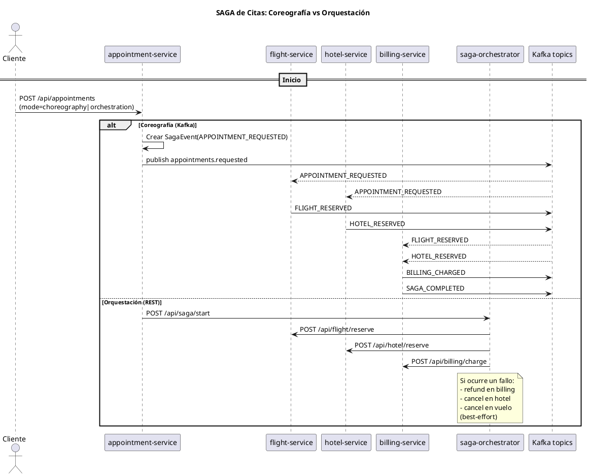

# Transacciones Distribuidas con SAGA (Coreografía y Orquestación)

Este proyecto multi‑módulo demuestra cómo implementar transacciones distribuidas
y consistencia eventual en una agencia de viajes usando el patrón SAGA, tanto en
su variante de coreografía (eventos vía Kafka) como en su variante de
orquestación (servicio orquestador realizando llamadas REST). Está construido
con Java 21 y Spring Boot/Spring Cloud 2025.

## Caso de uso

Un cliente solicita una cita de viaje. El proceso involucra:

- Reservar un vuelo (flight-service)
- Reservar un hotel (hotel-service)
- Realizar el cobro (billing-service)

El servicio **appointment-service** inicia la SAGA. Dependiendo del modo
elegido:

- **Coreografía**: publica un evento “APPOINTMENT_REQUESTED” en Kafka que
  consumen flight-service y hotel-service. Cuando ambos reservan,
  billing-service detecta que todo está listo, cobra y marca la SAGA como
  completada.
- **Orquestación**: un servicio específico (saga-orchestrator) invoca por REST a
  flight-service, hotel-service y billing-service; si algo falla, intenta
  compensar (cancelaciones/reembolso).

## Módulos

- common: DTOs y eventos compartidos (records de Java).
- appointment-service: API para iniciar la SAGA en modo coreografía u
  orquestación.
- flight-service: reserva de vuelos; escucha eventos de solicitud y responde con
  evento de vuelo reservado.
- hotel-service: reserva de hoteles; escucha eventos de solicitud y responde con
  evento de hotel reservado.
- billing-service: escucha eventos de reservas confirmadas y, cuando ambas
  existen, realiza el cobro y completa la SAGA.
- saga-orchestrator: endpoint REST para ejecutar la SAGA en modo orquestación
  con compensaciones best‑effort.

## Requisitos

- Java 21
- Maven 3.9+
- Docker y Docker Compose

## Compilación

- Empaquetar todos los módulos (se generan JARs ejecutables Spring Boot):
  mvn -DskipTests package

## Ejecución con Docker Compose

1) Construir imágenes:

  ```shell
  docker compose build
```

2) Levantar el entorno:

  ```shell
  docker compose up
```

3) Servicios expuestos (host local):

- saga-orchestrator: http://localhost:8080
- appointment-service: http://localhost:8081
- flight-service: http://localhost:8082
- hotel-service: http://localhost:8083
- billing-service: http://localhost:8084
- Kafka UI: http://localhost:8085 (explorador web para Kafka)
- Kafka (broker interno para servicios): kafka:9092 (expuesto en host: 9092)

Todos los servicios reciben KAFKA_BOOTSTRAP_SERVERS=kafka:9092 desde
docker-compose.yml.

### Kafka UI

- Interfaz web para explorar clústeres Kafka, tópicos, particiones, mensajes y
  consumos.
- URL local: http://localhost:8085
- En docker-compose.yml está preconfigurado el cluster "local" apuntando a
  kafka:9092.
- No requiere credenciales en este entorno. Permite ver y depurar los eventos de
  la SAGA.

## Endpoints principales

- appointment-service

```http request
POST /api/appointments?mode=choreography|orchestration
Content-Type: application/json

{
    "customerId":"c1",
    "fromAirport":"MAD",
    "toAirport":"CDG",
    "flightDate":"2025-12-20",
    "hotelCity":"París",
    "nights":2,
    "amountCents":10000
}
```

- Respuesta 202 con id de SAGA iniciada.

- saga-orchestrator (modo orquestación, llamado por appointment-service)

```http request
POST /api/saga/start
```

- flight-service (solo para orquestación y compensación)
    - POST /api/flight/reserve
    - POST /api/flight/cancel?reservationId=...

- hotel-service (solo para orquestación y compensación)
    - POST /api/hotel/reserve
    - POST /api/hotel/cancel?reservationId=...

- billing-service (solo para orquestación y compensación)
    - POST /api/billing/charge
    - POST /api/billing/refund?chargeId=...

## Tópicos de Kafka (coreografía)

- appointments.requested (publica appointment-service)
- flight.reserved (publica flight-service)
- hotel.reserved (publica hotel-service)
- billing.charged (publica billing-service)
- saga.completed (publica billing-service)

Los nombres se pueden ajustar vía application.yml en cada servicio (clave
topics.*).

## Flujo Coreografía (resumen)

1) appointment-service publica SagaEvent(APPOINTMENT_REQUESTED,
   payload=AppointmentRequest)
2) flight-service y hotel-service consumen ese evento y publican FLIGHT_RESERVED
   y HOTEL_RESERVED
3) billing-service observa ambos y publica BILLING_CHARGED y SAGA_COMPLETED

Compensaciones explícitas no se muestran en la coreografía mínima, pero podrían
añadirse con eventos de compensación.

## Flujo Orquestación (resumen)

1) appointment-service invoca /api/saga/start en saga-orchestrator
2) El orquestador llama secuencialmente a flight, hotel, billing
3) Si falla algún paso, intenta compensar (refund/cancel)

## Validación rápida

- Iniciar coreografía:

```shell
  curl -X POST "http://localhost:8081/api/appointments?mode=choreography" \
  -H "Content-Type: application/json" \
  -d '{"customerId":"c1","fromAirport":"MAD","toAirport":"CDG","flightDate":"
  2025-12-20","hotelCity":"Paris","nights":2,"amountCents":10000}'
```

- Iniciar orquestación:

```shell
curl -X POST "http://localhost:8081/api/appointments?mode=orchestration" \
  -H "Content-Type: application/json" \
  -d '{"customerId":"c1","fromAirport":"MAD","toAirport":"CDG","flightDate":"
  2025-12-20","hotelCity":"Paris","nights":2,"amountCents":10000}'
```

## Solución de problemas

- Si un servicio no conecta a Kafka: verifique KAFKA_BOOTSTRAP_SERVERS y que
  kafka esté healthy en Compose.
- Puertos ocupados: cambie el mapeo en docker-compose.yml.

## Desarrollo

- Java Records en los DTOs y eventos.
- Serialización JSON vía Spring Kafka con JsonSerializer/JsonDeserializer (sin
  type headers).
- Validación con Jakarta Validation en AppointmentRequest.

## Diagrama (PlantUML)

El siguiente diagrama resume ambos modos de la SAGA (Coreografía vía Kafka y
Orquestación vía REST). Puedes renderizarlo con cualquier visor PlantUML (por
ejemplo, plantuml.com/plantuml o extensiones de IDE) copiando el bloque tal
cual.


